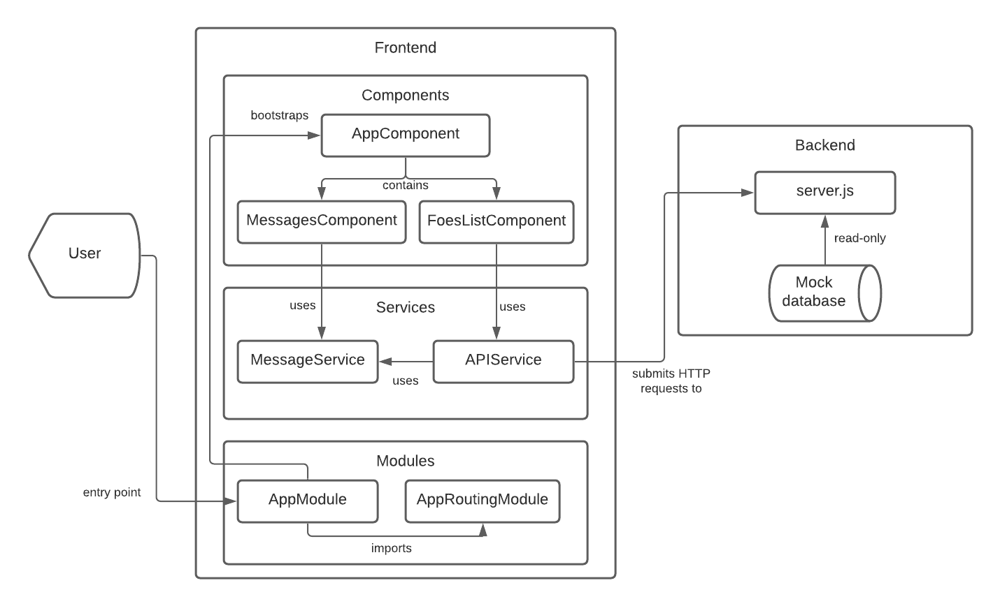

# Fødselsdagsprojekt

## Kørsel

- Kørsel af backend kræver en lokal installation af node.js (v16.6.1)
- Kørsel af frontend kræver NPM pakken `@angular/cli` (`npm install --global @angular/cli`)

Fra kommandoprompt:
- Frontend ligger i mappen `frontend` kan køres lokalt på Angular's interne testserver (`localhost:4200`) via `ng serve --open`.
- Backend ligger i mappen `backend` kan køres lokalt (`localhost:8081`) med nodejs via `node src/server.js`.

## Proces

Jeg har ikke før arbejdet med hverken Node.js eller Angular, og brugte derfor det første stykke tid på at gennemgå Angular's [Tour of Heroes](https://angular.io/tutorial) tutorial. Frontend-delen gør brug af stort set alt hvad jeg lærte her.

Efter denne tutorial tog arbejdet med selve opgaven omtrent 12 timer. Jeg startede med frontend-delen (med en mock database gennem `angular-in-memory-web-api`) og satte til sidst en simpel node.js REST API op.

## Oversigt

### API service

Henter data fra backend gennem HTTP requests og håndterer eventuelle fejl.

### Message service

Barebones service der kan bruges til at vise beskeder til brugeren. Hver besked indeholder tekst, en beskedtype (fejl, succes osv) samt et Semantic UI ikon.

### Foes-list komponent

Komponentet er ansvaligt for at vise listen over medarbejdere samt listens filtre. Afdelinger og (filtrerede) medarbejdere hentes fra API-servicen og gemmes i hver deres array. Hver gang filtret ændres, hentes der ny data fra API'en - dog bruges diverse rxjs operators til at optimisere antallet af requests.

### Messages komponent

Viser en simpel liste over beskeder fra Message servicen i toppen af brugerens browser.

### CSS Framework

Projektet bruger en færdigkompileret udgave af Semantic UI med standardtema. Interaktive komponenter er integreret i Angular gennem NPM-pakken `@richardlt/ng2-semantic-ui`.

### Backend

Minimalistisk node.js/Express server struktureret som en REST API. Data vises som JSON og er gemt i en mock database i filen `server.js`.

Mock-databasen bruger manuelt genererede UUIDs til id-felterne.

## Kendte problemer / muligheder for vidreudvikling

- Uge-filteret bruger i øjeblikket ikke ugenumre efter dansk standard. Filteret gør brug af day.js' [weekOfYear](https://day.js.org/docs/en/plugin/week-of-year) plugin, hvori uger starter på søndagen og udregnes anderledes - f.eks. udregnes denne uge - 31 - til at være uge 33. Kan løses ved brug af et bedre dato-library eller en hjemmelavet ugenummer-algoritme.
- Message-servicen viser en fejl for hver API-anmodning, der mislykkedes - det vil være mere brugervenligt hvis identiske fejl blev samlet til en enkelt besked.
- Projektet er ikke internationaliseret.
- Projektet mangler en rigtig database, f.eks. MongoDb - en mock database i ren javascript er hverken vedvarende eller skalerbar.
